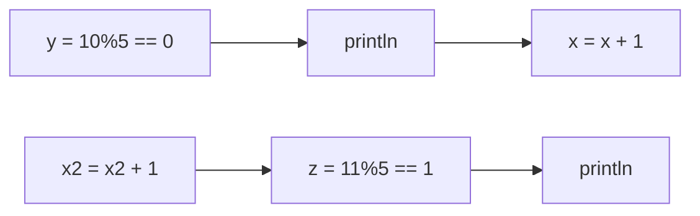

## Enunciado
int z = x++%5;
produce un valor de Z diferente que la instrucción
int z = ++x%5;

## Solución
 
```java
public class Ejercicio_5 {
    public static void main(String[] args) { 
    int x = 10;
    int x2 = 10;
    int y = x++%5;
    System.out.println("x++%5: " + y);
    int z = ++x2%5;
    System.out.println("++x%5: " + z);
    }
}
```

## Razonmaiento

El código se ejecuta de la siguiente manera:



Por lo tanto podemos asumir que sufijo se ejecuta siempre después de un *"Punto de ejecución"* como puede ser un System.out.println.

