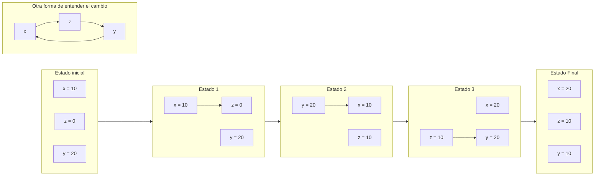

## Enunciado 

Añadir instrucciones que intercambien los valores de x e y, pero de forma que la solución sea
genérica para cualesquiera valores que contenga x e y en un momento dado. Para ello debes
utilizar una tercera variable z.

## Código Fuente

```java
class Unidad1{
    
 public static void main(String args[]){
 int x=10;
 int y=20;
 int z=0;
 System.out.println("ANTES. x vale "+ x + " y vale "+y );
 
 // Insturcciones de cambio de variables
 System.out.println("DESPUES. x vale "+ x + " y vale "+y );
 
 }
}
```
## Solución


```java
class Unidad1{
7
 public static void main(String args[]){
 int x=10;
 int y=20;
 int z=0;
 System.out.println("ANTES. x vale "+ x + " y vale "+y );
 
 // Insturcciones de cambio de variables

 // Valor de x -> z
 z = x;
 // Valor de y -> x
 x = y;
 // Valor de z -> y
 y = z;

 System.out.println("DESPUES. x vale "+ x + " y vale "+y );
 
 }
}
```
### Razonamiento

Es un set de instrucciones bastante sencillo:
- Guardamos el valor de una de las variables en otra variable temporal o auxiliar
- Sobreescribimos el dato que guardamos en la variable original
- Sobreescribimos el dato de la otra variable con el dato de la variable temporal 

con esto deberiamos de lograr intercambiar los datos. 



:::note
Es importante denotar que este set de instrucciones solos servirá para unos pocos elementos. Supongamos que queremos rotar los puestos de nuestra aula en una posición. Hacerlo de esta forma es ilegible, para eso deberiamos de crear un método con bucles y utilizar *Arrays*. 
:::