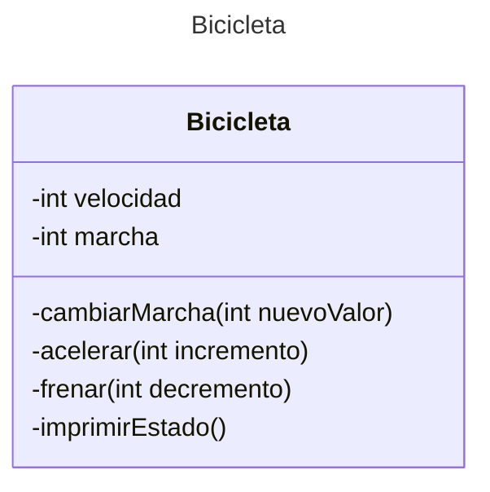

## Enunciado
Escribe la siguiente clase Bicicleta:


De forma que sea manejada por el siguiente main
```java
class Unidad2{
 public static void main(String[] args) {
        // Crea dous obxectos bicicleta
        Bicicleta bicicleta1 = new Bicicleta();
        Bicicleta bicicleta2 = new Bicicleta();
        // Invoca os métodos destes obxectos
        bicicleta1.acelerar(10);
        bicicleta1.cambiarMarcha(2);
        bicicleta1.imprimirEstado();
        bicicleta2.acelerar(10);
        bicicleta2.cambiarMarcha(2);
        bicicleta2.acelerar(10);
        bicicleta2.cambiarMarcha(3);
        bicicleta2.imprimirEstado();
    }
}
```
## Solución

```java
public class Bicicleta {

	int velocidad;
	int marcha;
	
	
	
	public int getVelocidad() {
		return velocidad;
	}

	public void setVelocidad(int velocidad) {
		this.velocidad = velocidad;
	}

	public int getMarcha() {
		return marcha;
	}

	public void setMarcha(int marcha) {
		this.marcha = marcha;
	}

	void cambiarMarcha(int nuevaMarcha) {
		marcha = nuevaMarcha;
	}
	
	void acelerar (int incremento) {
		velocidad += incremento;
	}
	
	void frenar (int decremento) {
		velocidad -= decremento;	
	}
	
	void imprimirEstado() {
		System.out.printf("Marcha: %d Velocidad: %d %n", marcha, velocidad);
	}
}
```
