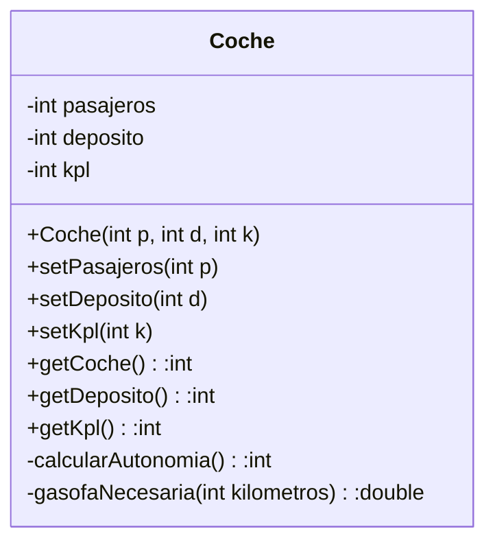

## Enunciado
Modifica el ejemplo de la clase coche añadiendo el constructor

## Solución
```java
	private int pasajeros;
	private int deposito;
	private int kpl;
	
	public Coche(int pasajeros, int deposito, int kpl) {
		this.pasajeros = pasajeros;
		this.deposito = deposito;
		this.kpl = kpl;
	}

	public int getPasajeros() {
		return pasajeros;
	}

	public void setPasajeros(int pasajeros) {
		this.pasajeros = pasajeros;
	}

	public int getDeposito() {
		return deposito;
	}

	public void setDeposito(int deposito) {
		this.deposito = deposito;
	}

	public int getKpl() {
		return kpl;
	}

	public void setKpl(int kpl) {
		this.kpl = kpl;
	}
	
	public int calcularAutonomia() {
		return deposito * kpl;
	}
	
	public double gasofaNecesaria(int kilometros) {
		return 0;
	}
```