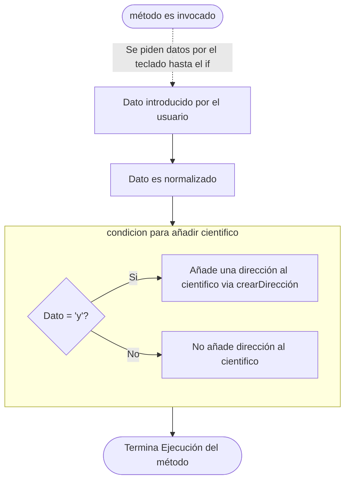

## Analisis de Necesidades:

Antes de empezar a escribir un proyecto y picar código es bueno dar un paso atrás y tener una visión general de los requerimientos del programa. Estos indicará que en mayor o menor medida que se necesitará.

Una buena técnica que se puede utilziar para esto es *DAC* que significa "Divide and Conquer" o "Dividir y Conquistar" se basa en la división de un programa en sus partes más núcleares o minimas.


### Necesidades:

- Creación de un proyecto
- Asignar cientificos a un proyecto
- Obtener datos del proyecto por teclado
- Calcular el presupuesto de un proyecto
- Mostrar información de un proyecto


#### Creación de un proyecto:

Cuando hablamos de *Crear* algo en programación orientada a objetos usualmente nos referimos a una de las siguientes cosas:

- Objetos
- Clases

Para crear un objeto necesitamos tener una clase, y ahora mismo no tenemos una clase *Proyecto* por ende la añadiremos a la lista de clases necesarias. 


#### Asignar cientificos a un proyecto

Debemos de poder Asignar un cientifico al proyecto, por ende el proyecto tendrá como uno de los datos un cientifico. Se nos dice que como mucho tendrá 3, asi que asignaremos 3 atributos a la clase proyecto que tendran como valor cientifico.

Pero, ¿Qué es un cientifico?

Se nos dice que tendra los siguientes atributos: nombre, edad y direccion. Podemos asumir que es un objeto. No podemos crear un objeto si una clase, por ende debemos de añadir la clase *Cientifico* a nuestra lista.

#### Obtener datos del proyecto por teclado

Java posee una clase llamada *Scanner* que nos permite guardar datos introducidos por el teclado, asi que sabemos que tendremos que utilizar dicha clase.

#### Calcular el presupuesto de un proyecto

Para calcular el presupuesto se nos da la siguiente formula: 

$$
presupuesto = num\_cientificos * meses * 5000
$$

Con esto sabemos que deberemos de tener alguna forma de contar a los cientificos. Ya sea con un condicional ternario, un if-else, o incluso un método que contenga alguno de los dos.

#### Mostrar la información de un proyecto:

Sabiendo que podemos *Sobreescribir* (Override) el método toString utilizaremos eso para mostrar la información por pantalla.

#### Clases necesarias:
- Proyecto
- Cientifico
- GestionadorDeProyectos (Main)

#### Clases opcionales:
- Direccion

## Analisis de Arquitectura:

Decidí crear 4 clases:
- Proyecto
- Cientifico
- Direccion
- Main

Proyecto, Cientifico y Direccion todas serán clases que permitiran crear dichos objetos y relacionarlos entre ellos. Main simplemente ejecutará las ordenes para que el programa cumpla los requisitos.

### Posibles preguntas

#### Clase Direccion:

¿Por qué una clase para dirección?

Pensando más a futuro sería muchisimo más facil de gestionar la dirección de alguien si esta dividida en partes. 

Imaginemos que queremos implementar una función de filtrado porque nos interesa que cientificos son de una ciudad u otras. 

Si tenemos un String habrá que procesarlo y debemos tener mucho cuidado a la hora de introducir el dato. En cambio si creamos un objeto podremos simplemente filtrar por la ciudad de los cientificos. 

Podriamos decir algo como: 
> Devuelveme todos los cientificos que tengan por ciudad Santiago

Se haría un bucle donde se pregunte ¿Ciudad de cientifico equivale a Santiago? Si es asi ponlo en esta lista y evalua el siguiente. Si no es asi, evalua al siguiente.

### Atributos privados:

Puesto que estamos trabajando con orientación programada objetos usualmente es buena idea restringir el uso de los atributos de clase. Esto se puede hacer con la palabra reservada *private* (Privado). *private* y *public* tienen que ver con un concepto llamado *Scope* o rango.

:::info "Scope" o "Rango"
El Scope es un tema bastante complicado. No os preocupeis si no lo entendeis del todo, no quiero expandir más en el tema porque mismamente yo tengo ciertas dificultades a la hora de explicarlo. 
:::
Se puede entender *private* como una especie de barrera que no permite accesar de forma directa a las propiedades. 

#### Ejemplo:

- Acceso directo: (Atributo no *private*)

```java
Direccion dir1 = new Direccion();
dir1.pais = "España";
```

- Acceso no directo: (Atributo private)

```java
Direccion dir1 = new Direccion();
dir.setDireccion("España");
```

### Sobrecarga y Sobreescritura:

En los métodos del programa se encontraran con ambas cosas, Sobrecarga y Sobreescritura de métodos:

#### Sobrecarga

Para entender la sobrecarga primero debemos entender que es lo que conforma "la firma" de un método. La firma del método será diferente pero su nombre será igual. Hagamos una analogia:

Tenemos dos métodos llamados: 

- Pepe()
- Pepe()

No podemos diferenciar entre Pepe() y Pepe(), el "nombre" es el mismo por ende dará error. Ahora, Pepe() es un tanto especial, unos dias solo se comunica por palabras y otros solo por números. Hacemos esa diferencia:

- Pepe(String comunicacion)
- Pepe(int comunicacion)

Pepe() tiene el atributo de comunicarse pero como dijimos anteriormente, unos dias se comunica por palabras y otros por números pero sigue siendo el mismo Pepe.

Pepe es un método sobrecargado. 

#### Sobreescritura

Utilizaremos la analogia anterior para Pepe tambien. Un dia pepe me dijo una verdad absoluta, me comentó lo siguiente: `01001101 01100001 01101100 01100100 01101001 01110100 01101111 00100000 01001101 01100001 01100100 01110101 01110010 01101111`. Yo al entenderlo me di cuenta de que Pepe() solo dice verdades. 

Asi que cambie a Pepe() por completo de tal forma que:

- Pepe(boolean comunicación)

Ahora Pepe() sólo se comunica en verdadero y falso. Me da igual que Pepe se comunicase antes por palabras o por números, realmente ahora Pepe() solo dice verdades o farsas.

Pepe() es un método que ha sido sobreescrito.

#### Sobrecarga y Sobreescritura en código:

Siguiendo el mismo ejemplo de Pepe() en código seria:

```java

// Sobrecarga:
public void Pepe(String comunicacion){

}

public void Pepe(String comunicacion){

}

// Sobreescritura:
@Override
    public void Pepe(boolean comunicacion){

    }

```
<a name="metCrear"></a>

#### métodos crearDireccion(), crearCientifico(), crearProyecto()

- ¿Por qué a este método se le pasa un Scanner?:

Si probais abriendo y cerrando Scanners en métodos a Java la da de lo suyo y esta que se muere. Inicialmente, se abrí un Scanner en los métodos de creación: crearDirección(), crearCientifico(), crearProyecto(). Resulta que al llegar al final de los datos introducidos Java por algún motivo cerraba todos o el Scanner que no debia y terminaba tirando un error que decia que el Scanner estaba cerrado cuando se esperaba una nueva linea. 

No puedo decirles si cierra todos los Scanners o cual de todos cerraba y cual causaba el error. Pasando un objeto Scanner abierto en Main soluciona este problema.

- ¿Qué es eso de "ParseInt"?

Los datos primitivos en Java tienen a su vez una Clase, dicha clase Se escribe con letra mayuscula. int tiene una clase llamada Integer. Dichas clases tienen métodos estáticos que sirven para ciertas cosas. En este caso `Integer.parseInt(String)` es un método o función que convierte un *String* a un *int*. 

- ¿Por qué usas eso en vez de Scanner.nextInt()?

A mi parecer, es muchisimo más facil manejarse con *Strings* y el uso único de `Scanner.nextLine()` que tener que adicionar dicho método cada vez que cambias de tipo de dato. Esto es una cuestión de preferencia. `Scanner.nextLine()` y el `Integer.parseInt(String)` cumplen la misma función de retornar el valor adecuado para la variable que queremos asignar. 

- ¿Qué es eso de setCalle() o setPais()?

Son los Setters y los Getters, utilizados principalmente cuando un atributo de una clase es *private* (privado). Es una buena práctica limitar quien y a que pueden accesar de una clase por ende intento adherirme a ello. Perfectamente se podria hacer con una asignación directa pero no sería lo más adecuado.

- ¿Qué es eso de "return this"?

Esto hace referencia a que el método retornara quien lo ha invocado. El método tiene que ser invocado o llamado por una Dirección, esa Dirección es el valor que se retornará. ¿Cómo es posible esto si para ello hay que crear una dirección primero?

Este método se debe ver en un contexto mayor, Este método es invocado realmente dentro de la clase Cientifico, que a su vez es invocado dentro de la clase proyecto, respectivamente en los métodos `crearCientifico(Scanner)` y `crearProyecto(Scanner)`

Estos 3 métodos son muy similares. Tienen, en general, el mismo comportamiento. 

- ¿Qué es eso de toLowerCase() y equals()?

Esto es una forma de modificar los datos que introduce al usuario para tener un procesamiento más fácil. Se le podría llamar "Normalización de datos"

La condición en el `if` de `crearCientifico()` funciona de la siguiente manera:



En este caso, los métodos invocados en la ejecución se ejecutan tal en el orden que van, supongamos que el usario introduce "AbC". 

- Primeramente obtenemos esos datos
- En esos datos invocamos el método `toLowerCase()` y normaliza "AbC" a "abc"
- Comparamos si "abc" es igual a "y"

El método `toLowerCase()` es un método de la clase String y el dato de `Scanner.nextLine()` es precisamente un *String*. Lo que hace es convertir todas las mayusculas a minisuculas. 

:::danger equals() vs operador == 
El método `equals()` compara **los valores** y no la **localización en memoria** de esos datos. Cuando usemos *Strings* y queramos compararlos es muy importante usar el método `equals()`
:::
```java
// Compara localización en memoria

sc.nextLine() == "y";

// Compara el valor del dato

sc.nextLine().equals("y");
```

#### Ternarios en asignar() y calcularCoste()

Estos métodos se pueden hacer de una cantidad de formas diferentes, en este caso se nos pide hacerlo con operadores ternarios.

Para entender mejor el operador ternario es una buena idea dividirlo en sus partes más atómicas. 

- Condición
- Termino 1 (Ejecutado si es verdadero)
- Termino 2 (Ejecutado si es verdadero)


Ahora, los *terminos* pueden ser cualquier cosa. Pueden incluso ser otro operador ternario. Una forma de enteder dicho operador es preguntado la condición misma, por ejemplo:

```java
String naranja = "naranja"
(naranja.equals("verde")) ? : System.out.println("Si, naranja es igual a verde") : System.out.println("No naranjan no es igual a verde")
```

Podemos hacer la pregunta: ¿es naranja igual a verde? Si es asi dime que son iguales : Si no es asi dime que son diferentes.

Una vez entendido esto podemos encadenar operadores ternarios de una manera mucho más sencilla:

```java
String naranja = "naranja"
(naranja.equals("verde")) ? : System.out.println("Si, naranja es igual a verde") : (naranja.equals("azul")) ? System.out.println("Si, naranja es igual a azul") : System.out.println("No, narnaja no es igual a azul.")
```
Primero preguntamos si Naranja es igual a verde, como no es así hacemos la siguiente pregunta, ¿Es naranja igual a azul? no, pues nos devuelve `"No, narnaja no es igual a azul"`.

Otra forma de pensar en esto, es pensar en una forma de arbol donde: 

```
Simple: 

Condicion ? 
    Termino 1 :
    Termino 2

Complejo: 

Condicion ? 
    Termino 1 :
    Termino 2 (Condicion ternaria) ?
        Termino 1 :
        Termino 2 (Condicion ternaria) ?
            Termino 1 :
            Termino 2
```

Volviendo a los métodos que utilizan dicho operador:

##### calcularPresupuesto()

Este método revisa si existe cada uno de los 3 cientificos 1 por 1. Si lo hay se le añade 1 a la variable local numDeCientificos. Esa variable luego es usada para calcular el presupuesto basandose en el enunciado. 

:::info
A la duración se le hace un cast o transformación de *int* a *double* para poder operar con presupuesto.
:::

##### asignar(int n, Cientifico C)

Este método tiene un entero que será utilizado para la condición ternaria y un cientifico que serán los datos donde se introduzca en lo que el indice nos dice. 

El código revisa si n, cumple alguna de las 3 condiciones establecidas. 

- n = 1
- n = 2
- n = 3

De cumplir alguna de ellas, introducira el objeto Cientifico en el atribut cient1, cient2 o cient3 correspondientemente. Si no cumple con ninguna condición los cientificos se quedarán con su valor anterior que se obtiene de `getCient1()`, `getCient2()`, `getCient3()` del proyecto. 

#### switch(condicion)

Esto no es más que otra estructura de control igual que el if-else. Tiene una sintaxis un poco diferente pero el concepto es el mismo. Solo que en este caso se evalua una variable y se ponen los "casos" posibles. 

Para el código solo existen los casos "1", "2", "3". Cualquier otro es el caso por defecto que simplemente termina la ejecución de la estructura de control. 

:::Tip
Ahora mismo intentar enteder el switch no es necesario, esto seguramente lo veremos cuando trabajemos con estructuras de control
:::
