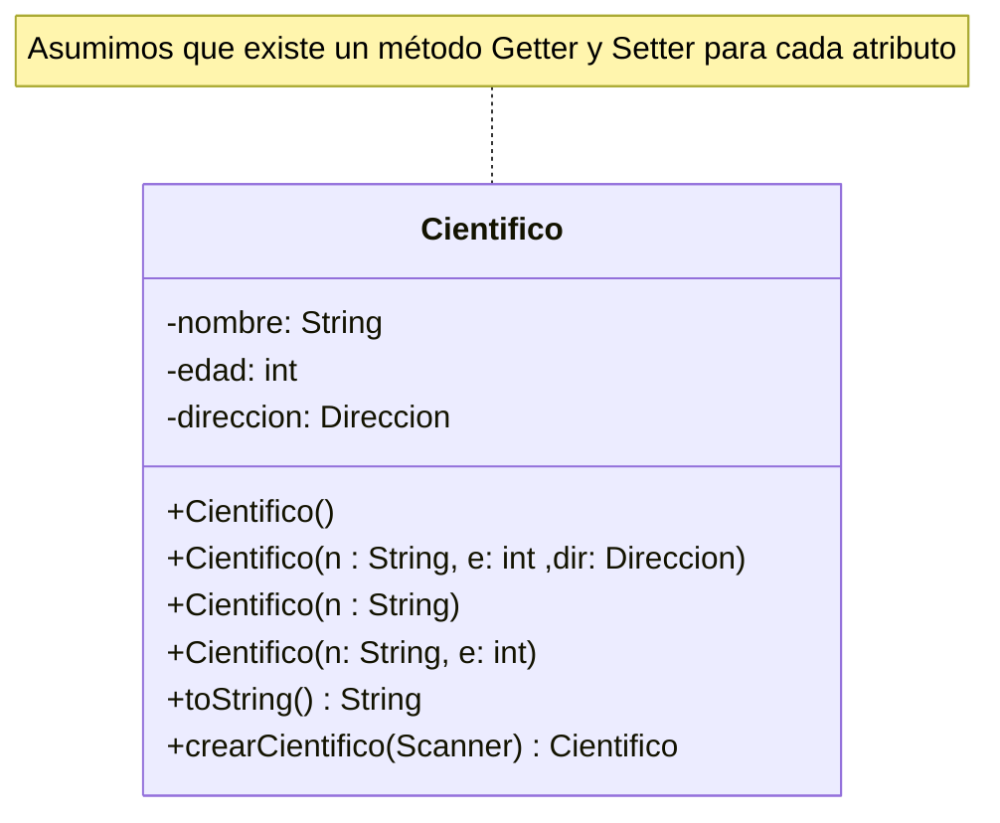

## Diagrama de clase



## Atributos

### nombre 

- Modificador de acceso: private (Privado)
- Descripción: Un atributo de tipo *String* que guardará el nombre de un Objeto Cientifico

### edad

- Modificador de acceso: private (Privado)
- Descripción: Un atributo de tipo *int* que guardará la edad de un Objeto Cientifico

### direccion

- Modificador de acceso: private (Privado)
- Descripción: Un atributo de tipo *Direccion* que guardará la Direccion (Objeto) de un Objeto Cientifico

## Métodos

### Constructores

#### Direccion()

- Modificador de acceso: public (Público)
- Parametros: N/A
- Sobrecarga / Sobreescritura: Si (Sobrecarga)
- Dato de retorno: N/A
- Descripción: Constructor por defecto. Creará un Objeto Cientifico vacio.

#### Direccion(String n)

- Modificador de acceso: public (Público)
- Parametros: *String* n
- Sobrecarga / Sobreescritura: Si (Sobrecarga)
- Dato de retorno: N/A
- Descripción: Constructor sólo con el nombre del Cientifico.

#### Direccion(String n, int e, Direccion dir)

- Modificador de acceso: public (Público)
- Parametros: *String* n, *int* e, *Direccion* dir
- Sobrecarga / Sobreescritura: Si (Sobrecarga)
- Dato de retorno: N/A
- Descripción: Constructor con todos los datos del Cientifico. Perfecto para cuando tenemos toda la información

#### Direccion(String n, Direccion dir)

- Modificador de acceso: public (Público)
- Parametros: *String* n, *Direccion* dir
- Sobrecarga / Sobreescritura: Si (Sobrecarga)
- Dato de retorno: N/A
- Descripción: Constructor sin la edad. Quizá haya algún cientifico que no nos quiera decir su edad.

#### Direccion(String n, int e)

- Modificador de acceso: public (Público)
- Parametros: *String* n, *int* e
- Sobrecarga / Sobreescritura: Si (Sobrecarga)
- Dato de retorno: N/A
- Descripción: Constructor sin una dirección. Quizá por privacidad no nos interesa guardar una dirección.

### Métodos no constructores

#### toString()

- Modificador de acceso: public (Público)
- Parametros: N/A
- Sobrecarga / Sobreescritura: Si (Sobreescritura)
- Dato de retorno: String
- Descripción: Método que sobreescribe el método toString() existente con los datos del objeto. La sobreescritura viene denotada por el *decorador* "@". 

#### crearCientifico(Scanner scanner)

- Modificador de acceso: public (Público)
- Parametros: Scanner scanner (Objeto de clase Scanner)
- Sobrecarga / Sobreescritura: No
- Dato de retorno: Cientifico
- Descripción: Método que introduce datos en un cientifico e invoca crearDirección(Scanner) de ser deseado.

:::info Funcionamiento
Este método es muy similar a [crearDireccion()](./Direccion.md#creardireccionscanner-scanner) el flujo del diagrama es muy parecido. Hay unas pocas cosas diferentes que serán descritas a continuación:
:::

##### Creación de un objeto dirección

Al inicio del programa se crea un objeto de dirección y se asigna a la dirección de este cientifico que luego es utilizado para el método crearDireccion(). 

#### Condicional Simple

Este condicional simple evalua si el dato introducido por el usuario es equivalente a "y", Si es asi ejecuta crearDirección, si no imprime por pantalla que dicho cientifico tendrá una dirección vacia. 

## Código Fuente

```java
package proyecto_cientifico;

import java.util.Scanner;

public class Cientifico {
	private String nombre;
	private int edad;
	private Direccion direccion;
	
	Cientifico(){
		
	};
	
	Cientifico(String n, int e, Direccion dir){
		nombre = n;
		edad = e;
		direccion = dir;
	}
	
	Cientifico(String n){
		nombre = n;
	}
	
	Cientifico(String n, Direccion dir){
		nombre = n;
		direccion = dir;
	}
	
	Cientifico(String n, int e){
		nombre = n;
		edad = e;
	}

	public String getNombre() {
		return nombre;
	}

	public void setNombre(String nombre) {
		this.nombre = nombre;
	}

	public int getEdad() {
		return edad;
	}

	public void setEdad(int edad) {
		this.edad = edad;
	}

	public Direccion getDireccion() {
		return direccion;
	}

	public void setDireccion(Direccion direccion) {
		this.direccion = direccion;
	}
	
	@Override
	
	public String toString() {
		return "\t\tNombre: " + getNombre() + "\n\t\tEdad: " + getEdad() + "\n\t\tDirección: \n" + getDireccion();
	};
	
	public Cientifico crearCientifico(Scanner scanner) {
		
		Scanner sc = scanner;
		setDireccion(new Direccion());
		
		System.out.println("Introduzca el nombre del cientifico:");
		setNombre(sc.nextLine());
		
		System.out.println("Introduzca la edad");
		setEdad(Integer.parseInt(sc.nextLine()));
		
		System.out.println("Quieres añadirle una dirección? Y/N");
		
		if(sc.nextLine().toLowerCase().equals("y")) {
			System.out.println("Introduzca la dirección");
			setDireccion(direccion.crearDireccion(sc));
		} else {
			System.out.println("Se ha creado un cientifico sin dirección");
		}
		
		return this;
	}
   
}
```