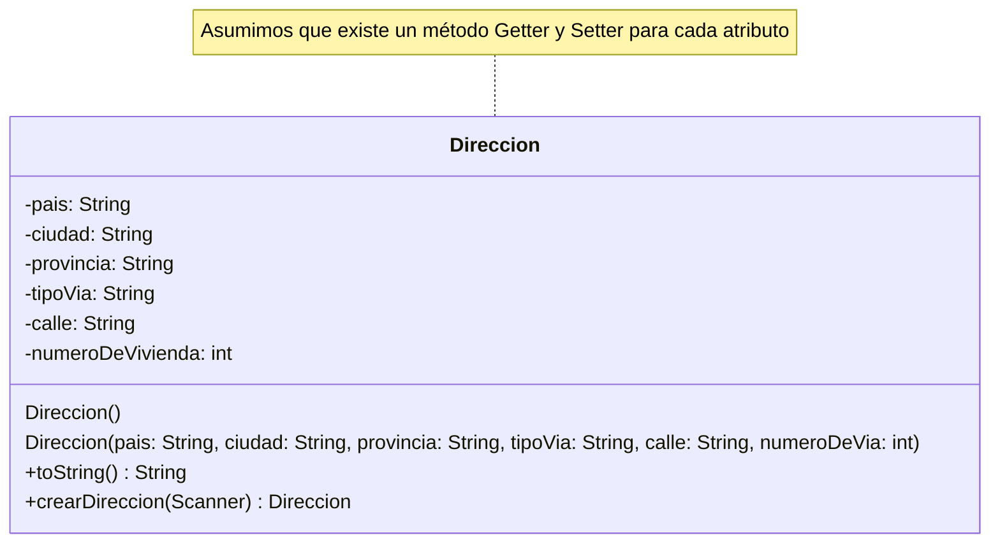
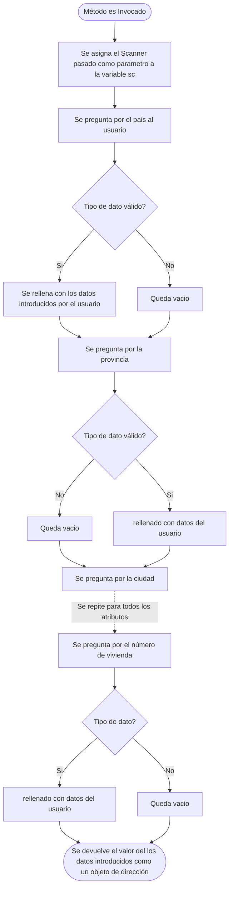

## Diagrama de Clase:

Este diagrama de clase esta como referencia para más adelante, por ahora no os preocupeis mucho con esto, es para dar una visión general de la clase. Se puede decir que es como un "Índice"


## Atributos

### pais

- Modificador de acceso: private (Privado)
- Descripción: Un atributo de tipo *String* que guardará el país de un Objeto Direccion

### ciudad

- Modificador de acceso: private (Privado)
- Descripción: Un atributo de tipo *String* que guardará el país de un Objeto Direccion

### provincia

- Modificador de acceso: private (Privado)
- Descripción: Un atributo de tipo *String* que guardará la provincia de un Objeto Direccion

### tipoVia

- Modificador de acceso: private (Privado)
- Descripción: Un atributo de tipo *String* que guardará el tipo de via de un Objeto Direccion

### calle

- Modificador de acceso: private (Privado)
- Descripción: Un atributo de tipo *String* que guardará la calle de un Objeto Direccion

### numeroDeVia

- Modificador de acceso: private (Privado)
- Descripción: Un atributo de tipo *int* que guardará el número de via de un Objeto Direccion

## Métodos

### Constructores

#### Direccion()

- Modificador de acceso: public (Público)
- Parametros: N/A
- Sobrecarga / Sobreescritura: Si (Sobrecarga)
- Dato de retorno: N/A
- Descripción: Constructor por defecto utilizado para crear un objeto Direccion vacío. Este constructor es utilizado en métodos como crearDirección para inicializar un Objeto donde se guardaran los datos. 

#### Direccion(String p, String ci, String pro, String tpv, String ca, int nvi)

- Modificador de acceso: public (Público)
- Parametros: String p, String ci, String pro, String tpv, String ca, int nvi
- Sobrecarga / Sobreescritura: Si (Sobrecarga)
- Dato de retorno: N/A
- Descripción: Constructor que se utiliza si queremos crear un objeto Direccion con todos sus datos.

### Métodos no constructores

#### toString()

- Modificador de acceso: public (Público)
- Parametros: N/A
- Sobrecarga / Sobreescritura: Si (Sobreescritura)
- Dato de retorno: String
- Descripción: Método que sobreescribe el método toString() existente con los datos del objeto. La sobreescritura viene denotada por el *decorador* "@". 

#### crearDireccion(Scanner scanner)

- Modificador de acceso: public (Público)
- Parametros: Scanner (Objeto)
- Sobrecarga / Sobreescritura: No
- Dato de retorno: Direccion (Objeto)
- Descripción: Método que crea una dirección a partir de los datos introducidos por el teclado. Estos datos del teclado salen del objeto Scanner que se le ha pasado como parametro. [Información del parametro Scanner en este método](../Descripción%20del%20programa.md#m%C3%A9todos-creardireccion-crearcientifico-crearproyecto)

#### Diagrama de flujo de funcionamiento:



## Código fuente:

```java
package proyecto_cientifico;

import java.util.Scanner;

public class Direccion {

	private String pais;
	private String ciudad;
	private String provincia;
	private String tipoVia;
	private String calle;
	private int numeroDeVivienda;
	
	public Direccion(String p, String ci, String pro, String tpv, String ca, int nvi) {
		pais = p;
		ciudad = ci;
		provincia = pro;
		tipoVia = tpv;
		calle = ca;
		numeroDeVivienda = nvi;
	}

	public Direccion() {
		
	}
	
	public String getPais() {
		return pais;
	}

	public void setPais(String pais) {
		this.pais = pais;
	}

	public String getCiudad() {
		return ciudad;
	}

	public void setCiudad(String ciudad) {
		this.ciudad = ciudad;
	}

	public String getProvincia() {
		return provincia;
	}

	public void setProvincia(String provincia) {
		this.provincia = provincia;
	}

	public String getTipoVia() {
		return tipoVia;
	}

	public void setTipoVia(String tipoVia) {
		this.tipoVia = tipoVia;
	}

	public String getCalle() {
		return calle;
	}

	public void setCalle(String calle) {
		this.calle = calle;
	}

	public int getNumeroDeVivienda() {
		return numeroDeVivienda;
	}

	public void setNumeroDeVivienda(int numeroDeVivienda) {
		this.numeroDeVivienda = numeroDeVivienda;
	}
	
	@Override
	
	public String toString() {
		return "\t\t\tPais: " + getPais() +"\n\t\t\tProvincia: " + getProvincia() + "\n\t\t\tCiudad: " + getCiudad() + "\n\t\t\tCalle: " + getTipoVia() + ", " + getCalle() + ", " + getNumeroDeVivienda();
	}
	
	public Direccion crearDireccion(Scanner scanner) {
		
		Scanner sc = scanner;
		
		System.out.println("Introduzca el pais: ");
		setPais(sc.nextLine());
		
		System.out.println("Introduca la provincia: ");
		setProvincia(sc.nextLine());
		
		System.out.println("Introduzca la ciudad: ");
		setCiudad(sc.nextLine());
		
		System.out.println("Introduzca el tipo de via: ");
		setTipoVia(sc.nextLine());
		
		System.out.println("Introduzca el nombre de la calle: ");
		setCalle(sc.nextLine());
		
		System.out.println("Introduzca el número de la vivienda");
		setNumeroDeVivienda(Integer.parseInt(sc.nextLine()));
		
		return this;
	}
}

```