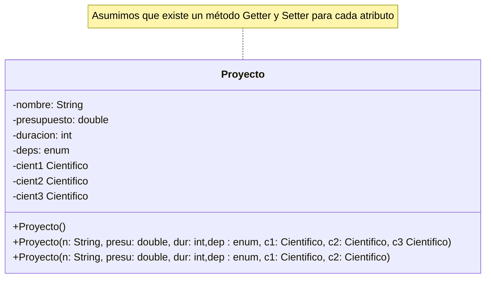

## Diagrama de Clase:

Este diagrama de clase esta como referencia para más adelante, por ahora no os preocupeis mucho con esto, es para dar una visión general de la clase. Se puede decir que es como un "Índice"



## Atributos

### nombre 

- Modificador de acceso: private (Privado)
- Descripción: Un atributo de tipo *String* que guardará el nombre de un Objeto Proyecto

### presupuesto 

- Modificador de acceso: private (Privado)
- Descripción: Un atributo de tipo *double* que guardará el nombre de un Objeto Proyecto

### duracion

- Modificador de acceso: private (Privado)
- Descripción: Un atributo de tipo *int* que guardará la duración de un Objeto Proyecto

### deps 

- Modificador de acceso: private (Privado)
- Descripción: Un atributo de tipo *enum* que guardará el departamento de un Objeto Proyecto

### cient1 

- Modificador de acceso: private (Privado)
- Descripción: Un atributo de tipo *Cientifico* que guardará un Cientifico de un Objeto Proyecto

### cient2 

- Modificador de acceso: private (Privado)
- Descripción: Un atributo de tipo *Cientifico* que guardará un Cientifico de un Objeto Proyecto

### cient3 

- Modificador de acceso: private (Privado)
- Descripción: Un atributo de tipo *Cientifico* que guardará un Cientifico de un Objeto Proyecto

## Métodos

### Constructores

#### Proyecto()

- Modificador de acceso: public (Público)
- Parametros: N/A
- Sobrecarga / Sobreescritura: Si (Sobrecarga)
- Dato de retorno: N/A
- Descripción: Constructor por defecto utilizado para crear un objeto Proyecto vacío. Este constructor es utilizado en métodos como crearProyecto() para inicializar un Objeto donde se guardaran los datos. 

#### Proyecto(String n, double presu, int dur, deps dep, Cientifico c1, Cientifico c2, Cientifico c3)

- Modificador de acceso: public (Público)
- Parametros: N/A
- Sobrecarga / Sobreescritura: Si (Sobrecarga)
- Dato de retorno: N/A
- Descripción: Constructor pedido por el enunciado con todos los datos que permite introducir 3 Cientificos al mismo tiempo con todos los datos del proyecto.

#### Proyecto(String n, double presu, int dur, deps dep, Cientifico c1, Cientifico c2)

- Modificador de acceso: public (Público)
- Parametros: String n, double presu, int dur, deps dep, Cientifico c1, Cientifico c2
- Sobrecarga / Sobreescritura: Si (Sobrecarga)
- Dato de retorno: N/A
- Descripción: Constructor pedido por el enunciado con todos los datos que permite introducir 2 Cientificos al mismo tiempo con todos los datos del proyecto.

### Métodos no Constructores

#### toString()

- Modificador de acceso: public (Público)
- Parametros: N/A
- Sobrecarga / Sobreescritura: Si (Sobreescritura)
- Dato de retorno: String
- Descripción: Método que sobreescribe el método toString() existente con los datos del objeto. La sobreescritura viene denotada por el *decorador* "@". 

#### crearProyecto(Scanner scanner)

- Modificador de acceso: public (Público)
- Parametros: Scanner scanner (Objeto de clase Scanner)
- Sobrecarga / Sobreescritura: No
- Dato de retorno: Proyecto
- Descripción: Método que introduce datos en un Proyecto e invoca crearCientifico(Scanner) de ser deseado un número *n* de veces, establecida por el usuario. (máximo 3)

Este método en principio parece muy grande, pero realmente es muy similar y repetitivo a lo que hace `crearCientifico()` y `crearDireccion()`.

- Se piden los datos por teclado utilizando o no ternarios (Como en el caso del enumerado)
- Se pregunta si se quieren crear cientificos y de ser asi se instancia la cantidad necesaria y se invoca el método `crearCientifico()` según el número introducido

#### calcularCoste()

- Modificador de acceso: public (Público)
- Parametros: N/A
- Sobrecarga / Sobreescritura: No
- Dato de retorno: *String*
- Descripción: Método que calcula el coste del proyecto en base a cuantos cientificos haya según la forma dada en el enunciado.

#### asignar(int n, Cientifico c)

- Modificador de acceso: public (Público)
- Parametros: int n, Cientifico c
- Sobrecarga / Sobreescritura: No
- Dato de retorno: N/A
- Descripción: Método que introduce datos de un cientifico en uno de los tres atributos de tipo Cientifico de la clase basandose en un indice i.

## Código Fuente

```java
package proyecto_cientifico;

import java.util.Scanner;

enum deps{MARKETING , INFORMATICA, INVESTIGACION};

public class Proyecto {
	
	private String nombre;
	private double presupuesto;
	private int duracion;
	private deps departamento;
	
	private Cientifico cient1;
	private Cientifico cient2;
	private Cientifico cient3;
	
	
	
	public Proyecto() {
		
	}
	
	public Proyecto(String n, double presu, int dur, deps dep, Cientifico c1, Cientifico c2, Cientifico c3) {
		nombre = n;
		presupuesto = presu;
		duracion = dur;
		departamento = dep;
		cient1 = c1;
		cient2 = c2;
		cient3 = c3;
	}
	
	public Proyecto(String n, double presu, int dur, deps dep, Cientifico c1, Cientifico c2) {
		nombre = n;
		presupuesto = presu;
		duracion = dur;
		departamento = dep;
		cient1 = c1;
		cient2 = c2;
	}
	
	
	public String getNombre() {
		return nombre;
	}
	
	public void setNombre(String nombre) {
		this.nombre = nombre;
	}
	
	public double getPresupuesto() {
		return presupuesto;
	}
	
	public void setPresupuesto(double presupuesto) {
		this.presupuesto = presupuesto;
	}
	
	public int getDuracion() {
		return duracion;
	}
	
	public void setDuracion(int duracion) {
		this.duracion = duracion;
	}
	
	public deps getDepartamento() {
		return departamento;
	}
	
	public void setDepartamento(deps departamento) {
		this.departamento = departamento;
	}
	
	public Cientifico getCient1() {
		return cient1;
	}
	
	public void setCient1(Cientifico cient1) {
		this.cient1 = cient1;
	}
	
	public Cientifico getCient2() {
		return cient2;
	}
	
	public void setCient2(Cientifico cient2) {
		this.cient2 = cient2;
	}
	
	public Cientifico getCient3() {
		return cient3;
	}
	
	public void setCient3(Cientifico cient3) {
		this.cient3 = cient3;
	}
	
	@Override
	
		public String toString() {
		return  "Nombre del proyecto: " + getNombre() +
				"\nPresupuesto: " + getPresupuesto() + 
				"\nDuración: " + getDuracion() + " meses" +
				"\nDepartamento: " + getDepartamento() +
				"\nCoste: " + calcularCoste() +
				"\nCientificos:\n\tCientifico 1:\n" + getCient1() +
				"\n\tCientifico 2:\n" + getCient2() +
				"\n\tCientifico 3:\n" + getCient3();
		}

	public String calcularCoste() {
		int numDeCientificos = 0;
		numDeCientificos = getCient1() != null ? numDeCientificos += 1 : numDeCientificos;
		numDeCientificos = getCient2() != null ? numDeCientificos += 1 : numDeCientificos;
		numDeCientificos = getCient3() != null ? numDeCientificos += 1 : numDeCientificos;
		
		return "El coste del proyecto es: " + (double)getDuracion() * getPresupuesto() * numDeCientificos + " €";
	}; 
	
	public void asignar(int i, Cientifico c) {
		setCient1((i == 1) ? c : getCient1());
		setCient2((i == 2) ? c : getCient2());
		setCient3((i == 3) ? c : getCient3());
	}
	
	public Proyecto crearProyecto(Scanner scanner) {
		
		Scanner sc = scanner;
	
		System.out.println("Introduzca el nombre del proyecto: ");
		setNombre(sc.nextLine());
		
		System.out.println("Introduzca la duración del proyecto en meses: ");
		setDuracion(Integer.parseInt(sc.nextLine()));
		
		System.out.println("Introduzca el presupuesto");
		setPresupuesto(Double.parseDouble(sc.nextLine()));
		
		System.out.println("Introduzca el departamento: 1 - Marketing , 2 - Informatica, 3 - Investigacion");
		setDepartamento((Integer.parseInt(sc.nextLine()) == 1) ? deps.MARKETING : (Integer.parseInt(sc.nextLine()) == 2) ? deps.INFORMATICA : (Integer.parseInt(sc.nextLine()) == 3) ? deps.INVESTIGACION : null );
		
		System.out.println("Quieres crear cientificos? Y/N");
		
		if (sc.nextLine().toLowerCase().equals("y")) {
			
			System.out.println("Cuantos cientificos quieres crear?");
			int numCientificosACrear = Integer.parseInt(sc.nextLine());
			// This can be done with a for where NumcientificosACrear is the max number of the loop. You should probably do it in array
			switch(numCientificosACrear) {
				case 1: 
					
					System.out.println("Creando Cientifico 1");
					setCient1(new Cientifico());
					setCient1(getCient1().crearCientifico(sc));
					
					break;
				case 2:
					
					System.out.println("Creando Cientifico 1");
					setCient1(new Cientifico());
					setCient1(getCient1().crearCientifico(sc));
					
					System.out.println("Creando Cientifico 2");
					setCient2(new Cientifico());
					setCient2(getCient2().crearCientifico(sc));
					
					break;
				case 3: 
					
					System.out.println("Creando Cientifico 1");
					setCient1(new Cientifico());
					setCient1(getCient1().crearCientifico(sc));
					
					System.out.println("Creando Cientifico 2");
					setCient2(new Cientifico());
					setCient2(getCient2().crearCientifico(sc));
					
					System.out.println("Creando Cientifico 3");
					setCient3(new Cientifico());
					setCient3(getCient3().crearCientifico(sc));
					
					break;
			}
		
		} else {
			
			System.out.println("Se ha creado un proyecto sin ningún cientifico asignado");
		
		}
		
		return this;
	}
	
}
```